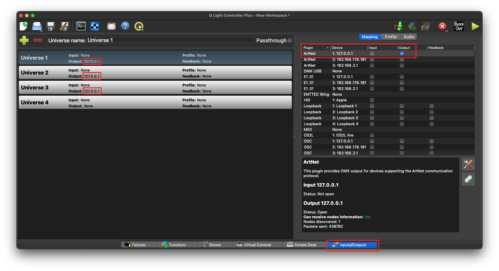
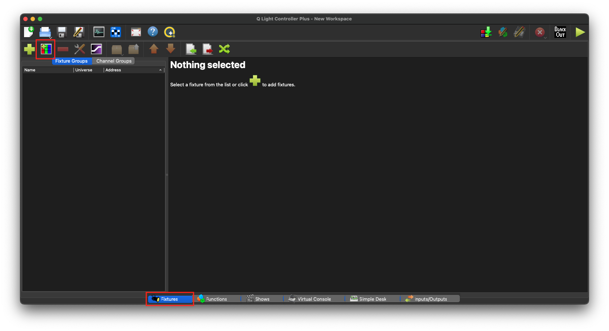
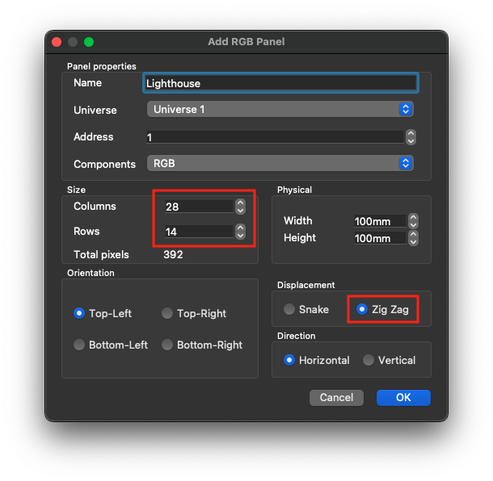
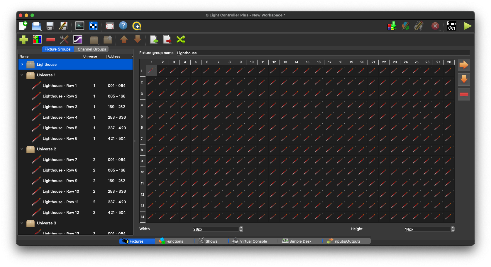
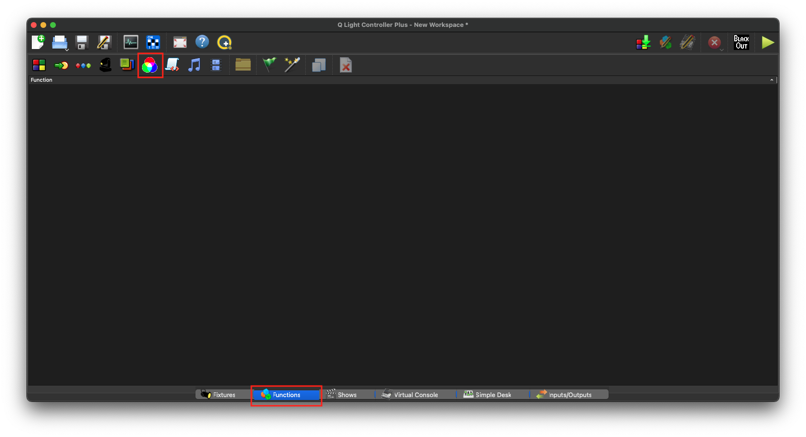
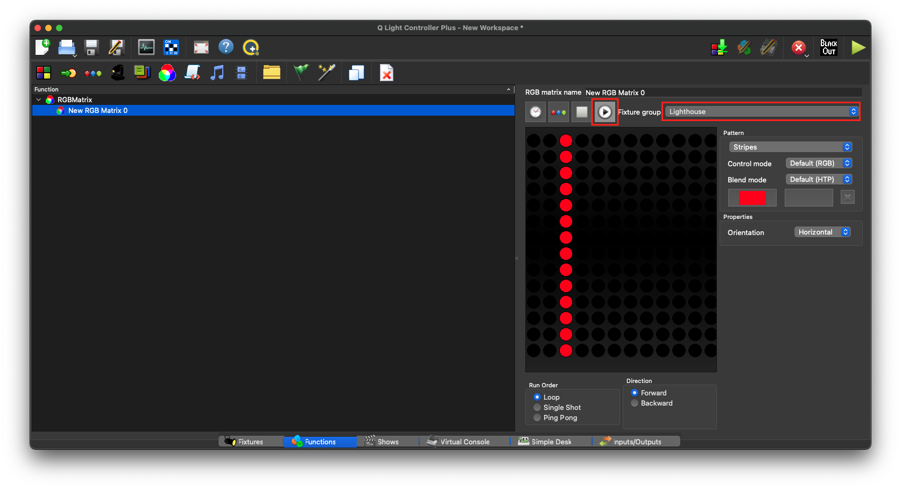
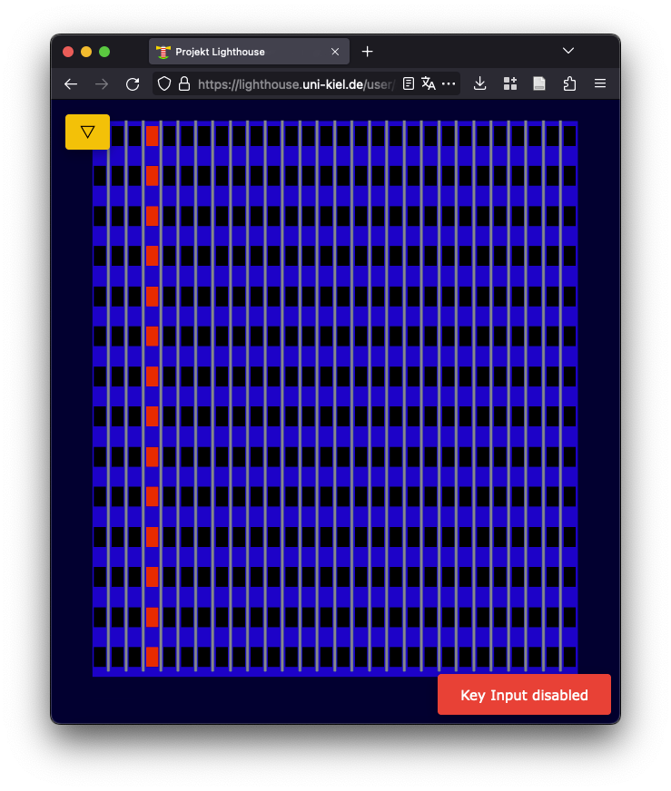

# Arthouse

[](https://crates.io/crates/arthouse)
[](https://github.com/fwcd/arthouse/actions/workflows/build.yml)

Art-Net (DMX over UDP/IP) adapter for Project Lighthouse.

Using this adapter, the Project Lighthouse display can be controlled like a standard DMX fixture from lighting controllers such as [QLC+](https://www.qlcplus.org/).

## Getting Started

Make sure that `LIGHTHOUSE_USER` and `LIGHTHOUSE_TOKEN` contain valid Project Lighthouse credentials, then run

```sh
cargo run
```

Alternatively you can also pass the corresponding command-line options, see `--help` for a detailed overview. By default, the adapter will listen on `0.0.0.0:6454`, i.e. the default Art-Net port, for UDP packets.

The following guide explains how to configure QLC+, though any other Art-Net client can be used too. First, make sure that the first three universes output to Art-Net on localhost:



Then add an RGB panel fixture:







Finally, create an RGB matrix and test one of the animations:





If everything went well, the output should be mirrored to the lighthouse:


